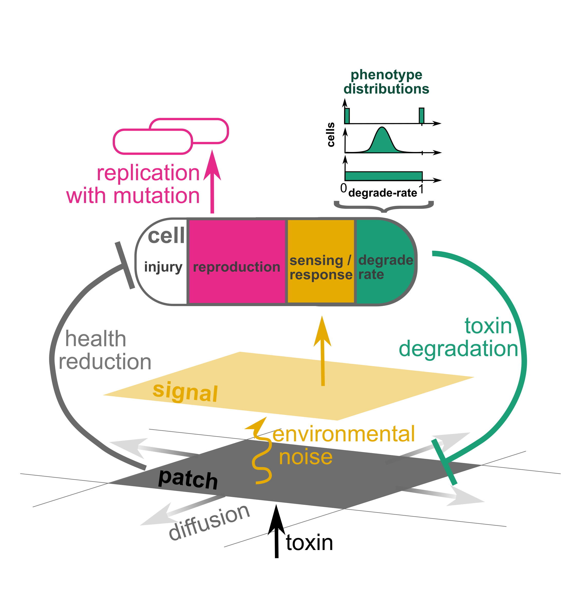

You and your sister microbes are being inundated with a toxin. You have to choose among spending your energy on measuring toxin concentrations in your environment, degrading the toxin, or reproducing. What do you prioitize? Should you and your (genetically identical) sister cells all follow the same strategy, or should you diversify (phenotypic heterogeneity)? This is a question faced by real microbes, but they don't have the benefit of centralized decision-making. The Pheno-Evo model allows you to explore the best possible solutions, and to test whether evolution can solve the problem.

Pheno-Evo is an agent-based model in 2D, written in NetLogo, specifically aimed at probing the evolutionary dynamics of microbial phenotypic heterogeneity. At this site, you'll find the following:
* **[The Pheno-Evo model](https://ritwikavps.github.io/pheno-evo.github.io/netlogomodel)**: available both for download and on the web
  * [desktop version, for download](https://github.com/jessicaaudreylee/pheno-evo/tree/master/netlogo_scripts/for_publication) 
  * [web version: play online!](https://ritwikavps.github.io/pheno-evo.github.io/pheno-evo_web.html)
  * [tutorial for Pheno-Evo experiment using BehaviorSpace](https://ritwikavps.github.io/pheno-evo.github.io/netlogomodel_tutorial)
* **[PhenoEvoR](https://ritwikavps.github.io/pheno-evo.github.io/about_PhenoEvoR)**: a package with tools for analyzing the output of the Pheno-Evo model
  * [example dataset download](https://drive.google.com/file/d/1u7aGSetxyY_kgFrck03udQt7sggRxQfA/view?usp=sharing)
  * [intro vignette](https://ritwikavps.github.io/pheno-evo.github.io/PhenoEvoR-intro-vignette)
* some [background information](https://ritwikavps.github.io/pheno-evo.github.io/background) on phenotypic heterogeneity and why we care

## News!
We're presenting a poster at [MEEVirtual](https://www.meevirtual.org/) this year!
If you missed MEEVirtual, you can still [see our poster here](https://ritwikavps.github.io/pheno-evo.github.io/images/MEEvirtual_poster_2020.png).

## Who we are

We are a group of scientists with diverse backgrounds and are interested in cool evolutionary stuff! We met at the 2019 [SFI Complex Systems Summer School](https://www.santafe.edu/engage/learn/schools/sfi-complex-systems-summer-school) -- the Pheno-Evo Project was a result of conversations we had there about microbial evolution. Our goal is to use this model to study the evolution of phenotypic diversity in microbes in two-dimensional space. 

Want to cite us? Please include this information:
JA Lee, D Borrero, K Leyba, P Mantri, A Reynolds, and R Vallomparambath PanikkasserySugasree. (2020) The Pheno-Evo model: Evolution of microbial phenotypic diversity in 2D space. https://everydaymicrobe.com/pheno-evo

Questions? Comments? Email [Jessica](https://everydaymicrobe.com/) at **jessica.audrey.lee (at) gmail.com**.
