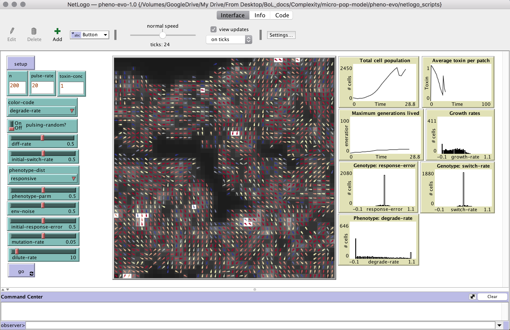

## An example Pheno-Evo experiment
Here are instructions for a small Pheno-Evo experiment that makes a good test case. This is what we did to generate the sample dataset [PhenoEvo_Example_Experiment.csv](https://ritwikavps.github.io/pheno-evo.github.io/netlogomodel). 

**Question**: How do the severity and unpredictability* of stress affect organisms' evolved phenotypic response?

**Approach**: Set toxin to pulse at a regular rate, and allow the microbes to switch their phenotypes in response to what they sense in the environment. Allow evolution of phenotype switching rate and response error. Run the model several times, varying two parameters: toxin concentration and environmental noise. Monitor how organisms' switch rate and response error evolve under these conditions, and the resulting effects on the distribution of degrade rates in the populations.

**Notes**: For the purposes of generating a tractable dataset, we're restricting ourselves to only 3 values each of toxin.conc and env.noise, and only 1,000 timepoints. In real life, we might want to try a higher number of parameter values. We might also run the model for longer, though just how long takes some judgment.

**Methods**:
1. Open the Pheno-Evo model in NetLogo on the desktop, and set sliders/choosers/buttons to the following values:
* n = 200
* pulse-rate = 20
* toxin-conc = [doesn't matter]
* color-code = [doesn't matter]
* pulsing-random? = Off
* diff-rate = 0.5
* initial-switch-rate = 0.5
* phenotype-dist = "responsive"
* phenotype-parm = 0.5
* env-noise [doesn't matter]
* initial-response-error = 0.5
* mutation-rate = 0.05
* dilute-rate = 10
2. In the menu on the top bar, choose Tools and navigate to BehaviorSpace.
3. Select "New" to create a new BehaviorSpace experiement.
4. Under "Vary variables as follows," enter the following:
* ["toxin-conc" 0 0.5 1]
* ["env-noise" 0 0.5 1]
5. Select 1 Repetition, check the boxes for "Run combinations in sequential order," and "Measure runs at every step," and enter Time limit = 1000.
6. Under "Measure runs using these reporters," enter the following:
* count turtles
* mean [toxin] of patches
* [degrade-rate] of turtles
* [switch-rate] of turtles
* [response-error] of turtles
* [barcode] of turtles
* [generation] of turtles
* [x-y-dr] of turtles
7. Under "Setup commands" enter: 
setup
Under "Go commands", enter: 
go
8. Hit "OK" to save the experiment and return to the BehaviorSpace Experiments list.
9. To run the experiment, make sure it's selected in the list, and hit the "Run" button.
10. In the Run options window that pops up, select "Table output" and deselect the other boxes. Enter the number of simultaneous runs that makes sense for your computer. Hit "OK."
11. A new window will open prompting you to name the output file and choose a place for it to be saved. Name it "PhenoEvo_Example_Experiment.csv" and save it wherever you'd like.
12. Once you've hit "Save," the experiment will begin running, and new window will open to update you on status. If you're doing a few simultaneous runs, this should take only a few minutes.
13. The resulting csv file can be loaded into R for analysis using [PhenoEvoR](https://ritwikavps.github.io/pheno-evo.github.io/about_PhenoEvoR).

* Another note: the interpretation of "unpredictability" and "environmental noise" here is a bit complicated. Noise (env.noise) here is essentially the layer that gets in between the actual environmental conditions (toxin concentrations) and the ability of the organisms to sense those conditions. If noise is low, the *signal* that organisms sense in their patch is pretty much equivalent to the actual *toxin* concentration. The higher the noise, the wider the potential margin between toxin and signal. At its highest limit, signal is essentially random, and organisms are unable to get any information about their environment.

To some, "unpredictable" carries a temporal connotation: it refers to whether one can know what will happen in the future. Here, we use the term in a loose sense, to refer to whether organisms can know what is going on around them in the moment. But to test temporal predictability and unpredictability would be an interesting extension of this model.

**[Back to home](https://ritwikavps.github.io/pheno-evo.github.io/)**
